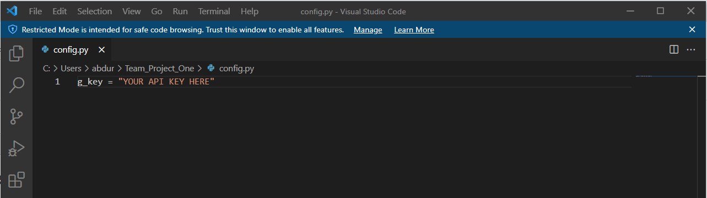
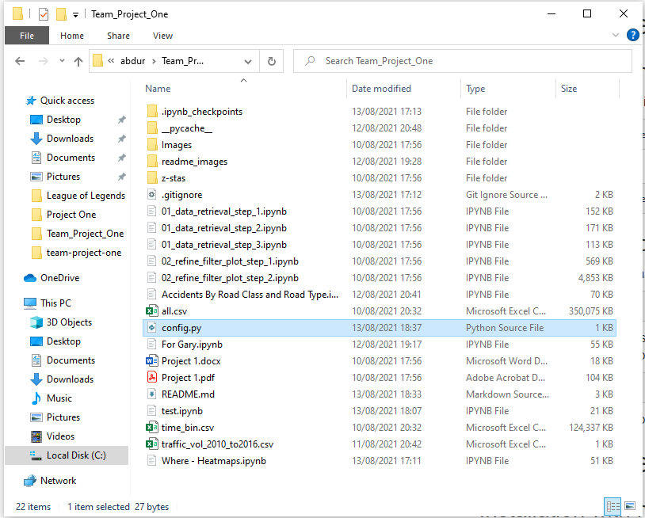

# Which factors contribute to accident risk?

This is a team based project that explored a traffic accident data set.

##  Contents

* [Dataset](#dataset-header)
* [Project Outline](#project-header)
* [Example Plots](#example-header)
* [Findings Reports and Presentation](#reports-header)
* [Dependencies and Setup Required](#dependencies-header)
* [How to View / Run the code](#how-header)
* [Which Jupyter Notebooks](#which-header)
* [Team](#team-header)

## Dataset

We used the [UK Road Safety: Traffic Accidents and Vehicles](https://www.kaggle.com/tsiaras/uk-road-safety-accidents-and-vehicles)\
Detailed dataset of road accidents and involved vehicles in the UK (2005-2017).\
Availble from [Kaggle.com](https://www.kaggle.com)

There are 2 CSV files in this data set. Both CSV files were merged into a single dataframe. The resulting data file extremely large so a decision was made to focus on Years 2010-2016. This data was filtered and placed into a New CSV which is the main data used for all the investigation, analysis and plots.

**Data Limitations**
It must be note that the data was limited in scope. Therefore, despite some interesting findings, the plots extracted from the data although **"true"**, do not **"tell the entire story".**

## Project Outline

We decided our client question would be **"which factors contribute to accident risk?"** and used this question to formulate 4 hypotheses and used these to target the data relevant to our hypotheses and attempt to turn that raw data in to **meaningful information**.

* **Hypothesis 1: Younger drivers are involved in more accidents**
* **Hypothesis 2: Driving on a weekday has no affect on the number of accidents**
* **Hypothesis 3: Higher speed limit increases the number of accidents**
* **Hypothesis 4: There are more accidents when the weather conditions are bad**

For each hypotheses we created a number of visualisations to display the data in an easier to analyse format which helped us understand the information required.

## Example Plots
Here are 2 examples plots we created from the data.

INSERT PLOTS HERE

The plots can be found in the images folder after running the code in the Notebook files that are in the root directory.

## Findings Reports and Presentation

The findings of this project can be found in the [/Presentation](Presentation/) directory.

There are 3 files:

* 01_Project_scope_notes.pdf
* 02_Presentation.pdf
* 02_Traffic Accidents Report.pdf

## Dependencies and Setup Required

In order to run the files you will need to install the following packages.

* gmaps `pip install gmaps`
* pandas `pip install pandas`
* seaborn `pip install seaborn`
* matplotlib `pip install matplotlib`
* scipy `pip install scipy`
* jupyter notebook `pip install notebook`

**Other Required Files:**

**Add the files into your local cloned repository!** 

* [all.csv](https://drive.google.com/file/d/1ES10z-PFW_QcRHwZx63NA42c2y1LmVPS/view?usp=sharing) (accidents from 2010-2016) - Download Here: - File was not included in the repository due to the large file size.

**Gmaps API Key requirement**

For gmaps you will also need an API key from the [Google Maps Platform](https://developers.google.com/maps). Please visit the Google maps platform to set up an API key if you do not already have one.

1. [config.py]() Download the file

2. Open the file in a text editor or VS code and change "YOUR API KEY HERE" to your API key from the Google Maps API.

3. The config.py file should be stored in your local repository root folder.

 

## How to View / Run the Code

The work was completed primarily using Jupyter Notebooks and the modules listed in the Dependencies section.

* Clone the repository and open the Jupyter Notebook files and run the cells in order.

The Jupyter notebook files have comments in the code and Markdown cells beneath each step explaining what was done.

## Which Jupyter Notebooks

* notebook 1.ipynb
* notebook 2.ipynb
* notebook 3.ipynb

## Credits / Collaborators / Team

Gary W\
Jessica Uppal\
Serdar B\
Arshad Sheikh\
Abdurrahman Raja